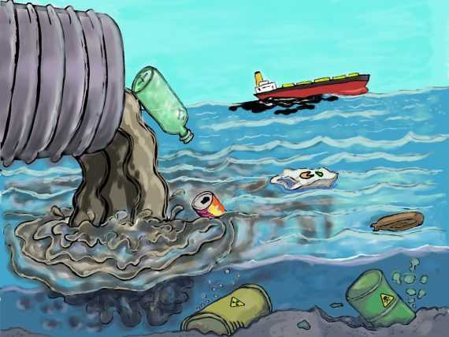

# Contaminación ambiental

## ¿Que es la contaminación ambiental?

Es la presencia de sustancias y energías en el medio ambiente, que afectan de forma negativa a  el entorno y los seres vivos.

## Tipos de contaminación 

### Contaminacion atmosférica

Ocurre cuando las partículas y gases nocivos se mezclan con el aire, esto afecta a la salud respiratoria.

**Industrial**: proviene de la polución de las fabricas y centrales de energía.

**Urbana**: por vehículos.

**Natural**: producida por desastres narutales.

### Contaminación hídrica

Ocurre cuando ríos, lagos, océanos y fuentes de agua subterránea se contaminan con residuos, afectando a especies animales, vegetales y al ser humano, convirtiendo el agua potable en no potable.

**Contaminación por metales pesados**: proviene de industrias mineras y fábricas.

**Contaminación biológica**: causada por bacterias y virus en el agua.

**Contaminación química**: originada por pesticidas, fertilizantes y productos industriales.

### Contaminación acústica

 Ocurre por ruidos excesivos en términos de volumen, frecuencia o ritmo, como los que provienen de barrios ruidosos, aeropuertos, autopistas, etc.

 **Ruido urbano**: causado por el tráfico y la construcción.

 **Ruido industrial**: generado por fábricas y áreas industriales.

 **Ruido de transporte**: procedente de trenes, aviones, coches y barcos.

 
### Contaminación lumínica

Se refiere al exceso de luz artificial, especialmente en las ciudades durante la noche. Aunque no pone en riesgo la supervivencia humana, puede causar problemas de visión, alteraciones del sueño y migrañas.

**Resplandor nocturno**: cuando el cielo se ilumina por luz artificial.

**Intrusión de luz**: cuando la luz exterior entra en espacios cerrados.

**Exceso de iluminación**: como en algunos espacios públicos.
