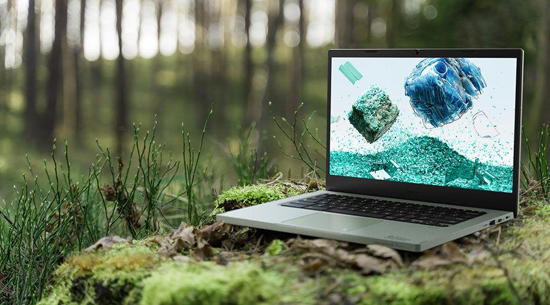

# Informatica ecológica

## ¿Que es la informática ecológica?

Es el diseño, la fabricación, el uso y la eliminación de ordenadores, chips, otros componentes tecnológicos y periféricos de forma que se limite el impacto al medioambiente.

De esta forma se reduce las emisiones de CO2 y el consumo de energía de parte de las fábricas, las empresas y las personas. Se priorizan las materias de origen sostenible, la reducción de residuos electrónicos y el uso de la sostenibilidad.

## La evolución de la informática ecológica

En 1992, la EPA de EE. UU. lanzó el programa Energy Star para promover la eficiencia energética, lo que impulsó la adopción de funciones como el modo reposo en la tecnología informática. Los productos con esta certificación deben cumplir con estándares operativos específicos y contar con funciones de gestión energética.

Este programa llevó a la creación de la herramienta EPEAT, que evalúa productos electrónicos en base a criterios como materiales, emisiones de gases de efecto invernadero, longevidad, consumo de energía y gestión del final de su ciclo de vida.

Antes de la informática ecológica, el enfoque de la TI era producir dispositivos más rápidos y pequeños, pero la computación en la nube ha impulsado un enfoque más sostenible. Existen varias iniciativas y métricas para mejorar la sostenibilidad en la informática, como el Green500, que clasifica superordenadores según su eficiencia energética, y SPECPower, que mide el rendimiento y la potencia de los servidores para mejorar la eficiencia.

