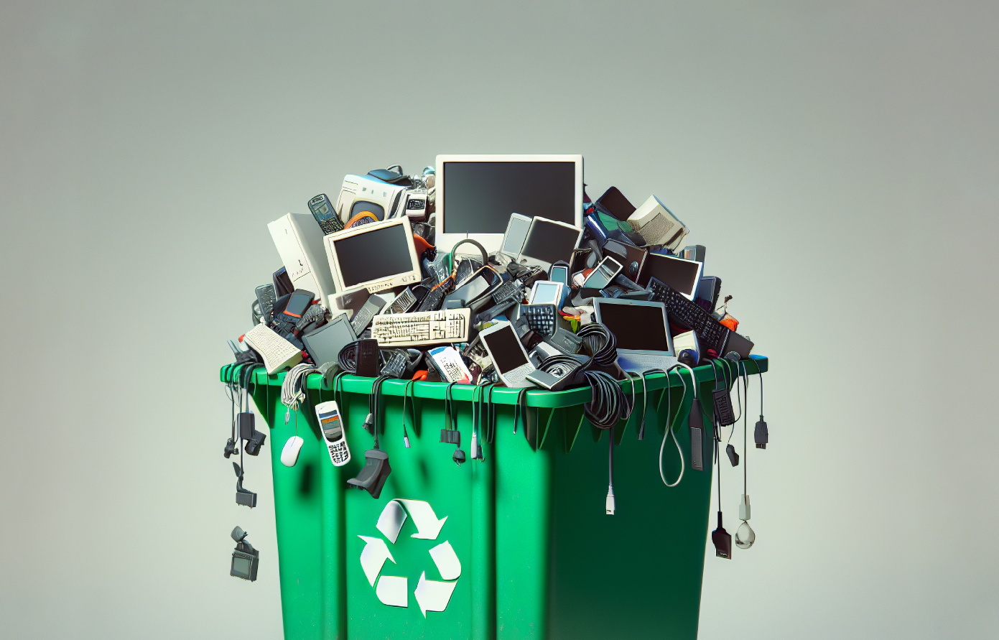

### **Obsolescencia Programada: Un Fenómeno que Afecta al Medio Ambiente**

La obsolescencia programada es el fenómeno por el cual los productos, especialmente electrónicos, están diseñados para volverse obsoletos o inutilizables después de un tiempo determinado. Esta práctica tiene un impacto directo en el consumo, la basura tecnológica y, en última instancia, en el medio ambiente. En este artículo se explican sus consecuencias y cómo podemos combatirla.

---

### **¿Qué es la Obsolescencia Programada?**

La obsolescencia programada se refiere a cuando los fabricantes diseñan productos con una vida útil limitada, con el objetivo de que los consumidores deban reemplazarlos después de un periodo corto. Esto puede deberse a fallos técnicos premeditados, a la aparición de productos más avanzados o simplemente a cambios de moda que hacen que lo anterior pierda atractivo.

**Origen del Concepto:**  
Este concepto se originó en la industria automotriz estadounidense en 1924, cuando Alfred P. Sloan, ejecutivo de General Motors, sugirió la idea de renovar modelos de coches cada año para mantener las ventas altas.

---

### **¿A Qué Productos Afecta?**

La obsolescencia programada no se limita solo a los dispositivos electrónicos, sino que también afecta a otros productos de consumo masivo. Algunos ejemplos incluyen:

- **Electrónica de Consumo:** Móviles, ordenadores, televisores, electrodomésticos (como lavadoras y microondas).
- **Industria Automotriz:** Los coches a menudo tienen componentes que dejan de ser compatibles con los avances tecnológicos.
- **Moda y Textiles:** La industria de la moda crea tendencias que hacen que las prendas de temporadas anteriores se perciban como "pasadas de moda".
- **Software:** Algunos programas dejan de ser compatibles con versiones antiguas de hardware.

---

### **Tipos de Obsolescencia Programada**

Existen varios tipos de obsolescencia programada, cada uno con métodos distintos para hacer que los productos queden obsoletos:

1. **Obsolescencia Sistémica:** Se da cuando el hardware ya no es compatible con nuevas actualizaciones del software o con dispositivos nuevos. Un ejemplo claro son los ordenadores que no pueden actualizarse con las últimas versiones del sistema operativo.

2. **Obsolescencia Percibida:** En este caso, el producto sigue funcionando, pero los consumidores perciben que ya no es deseable por cambios en el diseño o en las características, como ocurre con los teléfonos móviles que se renuevan cada año con pequeños cambios.

3. **Obsolescencia Fechada:** Algunos productos dejan de funcionar después de una fecha específica, incluso si aún podrían estar en buen estado. Esto puede incluir dispositivos electrónicos con software desactivado después de una fecha límite.

4. **Obsolescencia Legal:** En algunos casos, la legislación obliga a los productos a dejar de utilizarse, como los vehículos que deben cumplir con normativas ambientales y no pueden circular en ciertas áreas.

---

### **Ventajas y Desventajas de la Obsolescencia Programada**

**Ventajas para las Empresas:**
- **Incremento de Ventas:** Al generar productos con una vida útil corta, las empresas fomentan un ciclo continuo de compras.
- **Innovación Constante:** La obsolescencia programada también puede estimular la investigación y el desarrollo de nuevos productos y tecnologías.

**Desventajas para los Consumidores y el Medio Ambiente:**
- **Generación de Residuos:** Al desechar productos prematuramente, se aumenta la cantidad de basura tecnológica, que no siempre es reciclada adecuadamente.
- **Impacto Ambiental:** La obsolescencia programada contribuye a la sobreexplotación de recursos naturales y al aumento de la contaminación.
- **Estrés Económico:** Los consumidores se ven obligados a gastar más dinero en productos nuevos, lo que puede generar endeudamiento o insatisfacción.

---

### **La Obsolescencia Programada y el Medio Ambiente**

El aumento de la basura tecnológica es uno de los problemas más serios derivados de la obsolescencia programada. Los productos, aunque funcionales, se descartan a medida que se lanzan nuevos modelos o versiones. Este desecho constante genera millones de toneladas de residuos que, en muchos casos, no se reciclan adecuadamente.

**Estadísticas Globales:**
- En 2014, se generaron 41 millones de toneladas de residuos electrónicos.
- En 2016, esta cifra aumentó a 45 millones de toneladas.
- Para 2022, la cantidad llegó a 62 millones de toneladas.

Además, la producción de nuevos dispositivos consume grandes cantidades de materias primas, algunas de ellas muy raras, como el coltán, que se usa en las baterías. Todo este proceso de fabricación y distribución contribuye significativamente a la contaminación y al cambio climático.

---

### **¿Qué Puedes Hacer Para Reducir la Basura Tecnológica?**

A nivel individual, existen varias maneras de mitigar el impacto de la obsolescencia programada sobre el medio ambiente:

1. **Reparar:** Si un producto se avería, trata de repararlo en lugar de comprar uno nuevo. Muchas veces los dispositivos pueden ser arreglados con piezas de repuesto o ajustes simples.
   
2. **Reutilizar:** Si no necesitas un producto, considera donarlo o venderlo a alguien que pueda darle una segunda vida. Esto es especialmente útil para dispositivos electrónicos que aún funcionan bien.
   
3. **Reciclar:** Cuando un producto llegue al final de su vida útil, asegúrate de llevarlo a un centro de reciclaje adecuado. El reciclaje de materiales como plástico, metal y vidrio ayuda a reducir la demanda de recursos naturales.

---

### **Luchando Contra la Obsolescencia Programada**

A nivel colectivo, se están tomando medidas para combatir la obsolescencia programada y fomentar una mayor durabilidad de los productos. Algunos ejemplos incluyen:

- **Legislación:** En la Unión Europea, se han propuesto etiquetas que indiquen la duración esperada de los productos. Francia ha aprobado leyes que requieren esta información.
- **Derecho a Reparar:** La plataforma **Right to Repair** promueve la creación de productos más duraderos y el derecho de los consumidores a repararlos. Recientemente, Alemania introdujo una ley que exige que los teléfonos móviles tengan una vida útil mínima de siete años.
