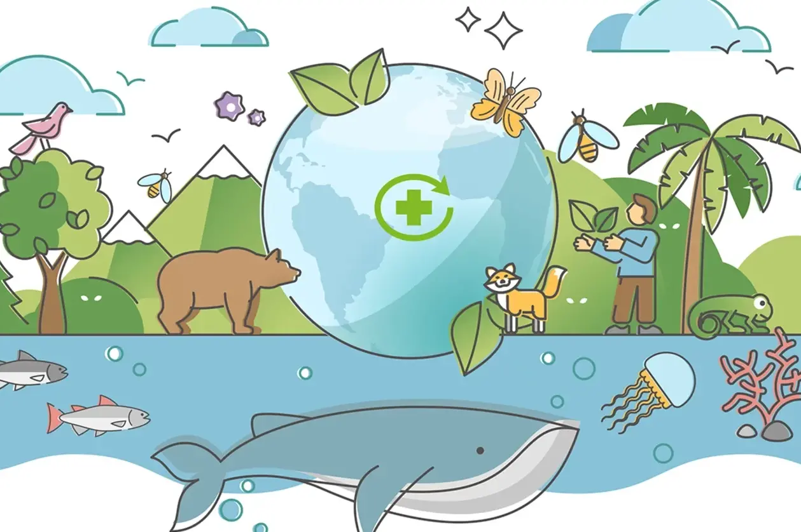

# Protección mediambiental

## Índice

1.1.-[¿Qué es la contaminación ambiental?](Contaminacion_ambiental.md)

1.2.-[Residuos informáticos](Residuos_informáticos.md)

1.3.-[Obsolescencia programada](Obsolescencia_programada.md)

1.4.-[Informática ecológica](Informática_ecológica.md)

**Referencias:**

[Contaminación](https://ayudaenaccion.org/blog/sostenibilidad/tipos-contaminacion-ambiental/)

[ChatGPT](https://chatgpt.com/)

[Iberdrola](https://www.iberdrola.com/sostenibilidad/obsolescencia-programada)

**Autores**

[DSR](https://github.com/JohnDSil)

[IBL](https://github.com/IvanBL8)

[GCR](https://github.com/Guille98-ASIR)
