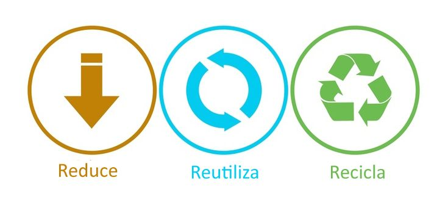

## RESIDUOS INFORMÁTICOS

La proliferación de dispositivos digitales se está convirtiendo en un problema para el planeta porque, cuando su vida útil finaliza, al año se generan más de 50 millones de toneladas de chatarra tecnológica, su tasa de reciclaje es insuficiente.
Aumentarla es clave para frenar el cambio climático y evitar el deterioro del medio ambiente.

# EL PROBLEMA DE LA BASURA TECNOLÓGICA

Cada año se generan más de 50 millones de toneladas de basura electrónica, de las cuales solo el 17,4 % se recicla, se estima que para 2050 la cantidad de desechos electrónicos podría alcanzar los 120 millones de toneladas. Estos residuos contienen sustancias tóxicas como cadmio, plomo, mercurio, y otros, que contaminan el medio ambiente, afectando ríos, lagos y el aire.

**Plomo:** Comúnmente utilizado en soldaduras y pantallas.
**Cadmio:** Encontrado en baterías recargables.
**Mercurio:** Usado en pantallas LCD y otros componentes.
**Níquel, antimonio y arsénico:** Sustancias peligrosas presentes en algunas partes de los dispositivos.

Para mitigar este problema, es crucial promover un consumo responsable y la reutilización de dispositivos electrónicos. Empresas como Back Market, que se dedican al reacondicionamiento de aparatos, ofrecen una alternativa viable frente al ineficaz sistema actual de reciclaje.

# ¿CÓMO REDUCIR LA CHATARRA TECNOLÓGICA?

Los desechos electrónicos son el tipo de desechos que más rápido crecen en el mundo, ante esta tesitura, urge tomar medidas. A continuación, repasamos algunas de ellas:

 **Reducir**
 Cada vez se consumen más aparatos y se sustituyen con mayor celeridad. Cambiar esta tendencia depende tanto del usuario, que debe mostrarse menos permeable a las estrategias de marketing que fomentan el consumo; como de los fabricantes, que cada vez
 más apuestan por tendencias como el ecodiseño.

**Reutilizar**
Los expertos en reciclaje electrónico recomiendan que amigos o familiares hereden los aparatos que todavía funcionan, o que se oferten en el mercado de segunda mano. También existe la posibilidad de donar el producto a una ONG especializada.

 **Reciclar**
 Cuando el producto ya no funciona y no puede ser utilizado por alguien cercano se debe optar por el reciclaje. Una alternativa para el consumidor es entregar el aparato viejo en el establecimiento donde compra el nuevo o a alguna empresa que se
 dedique al reacondicionamiento electrónico.

 
