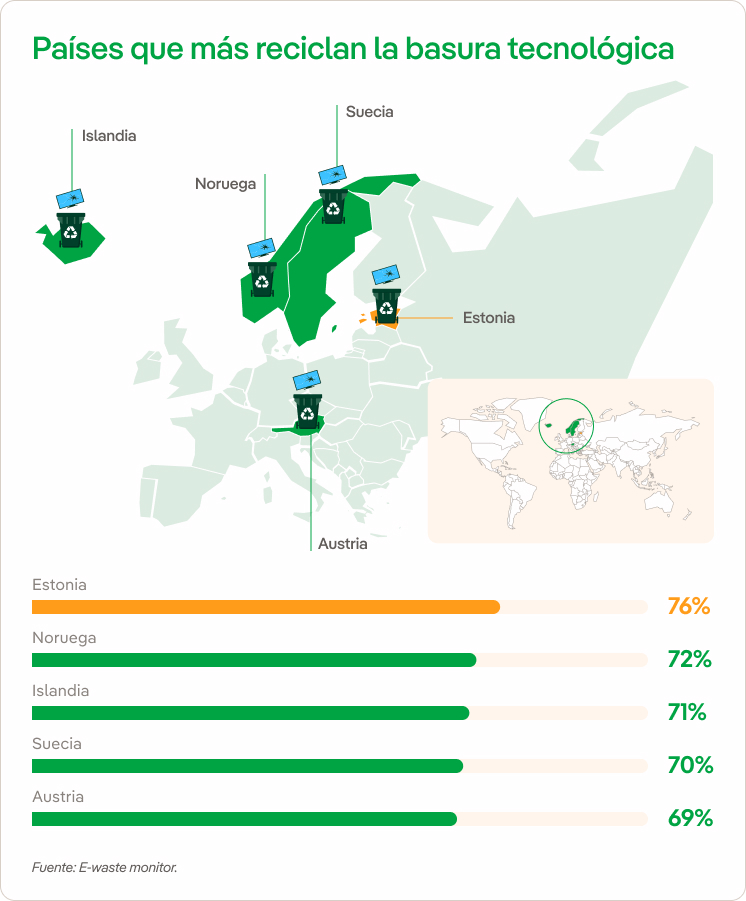

## RESIDUOS INFORMÁTICOS

La proliferación de dispositivos digitales se está convirtiendo en un problema para el planeta porque, cuando su vida útil finaliza, al año se generan más de 50 millones de toneladas de chatarra tecnológica, su tasa de reciclaje es insuficiente.
Aumentarla es clave para frenar el cambio climático y evitar el deterioro del medio ambiente.

# EL PROBLEMA DE LA BASURA TECNOLÓGICA

Cada año se generan más de 50 millones de toneladas de basura electrónica, de las cuales solo el 17,4 % se recicla, se estima que para 2050 la cantidad de desechos electrónicos podría alcanzar los 120 millones de toneladas. Estos residuos contienen sustancias tóxicas como cadmio, plomo, mercurio, y otros, que contaminan el medio ambiente, afectando ríos, lagos y el aire. Para mitigar este problema, es crucial promover un consumo responsable y la reutilización de dispositivos electrónicos. Empresas como Back Market, que se dedican al reacondicionamiento de aparatos, ofrecen una alternativa viable frente al ineficaz sistema actual de reciclaje.

